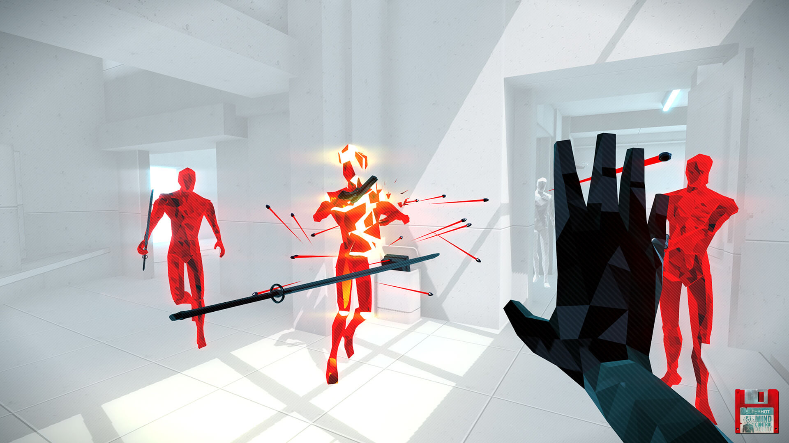
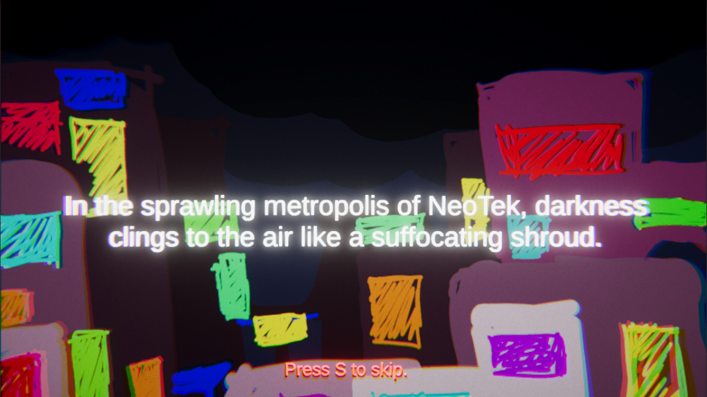

# Installation

Installation is very simple - the game comes already packaged in an executable for Windows, and it’s run and play.

## Playing instructions

All relevant controls are explained in-game, and are, either way, simple and intuitive to follow.
The game follows basic movement conventions - WASD control scheme to move around, and Space to jump. The robot also has access to a quickstep on Shift, which provides a sudden burst of directed movement and avoids all damage. LMB performs the equipped weapon’s basic move, which may be part of a basic combo, while RMB performs the weapon’s special move. To access the pause menu press P. The main objective of the game is to kill every enemy and access the final golden game waypoints, you may also encounter purple checkpoints which you have to complete in order to proceed in the level.

# Introduction

Welcome to ***Miasma***, an electrifying and adrenaline-pumping
cyberpunk 3D FPS game that will immerse you in a futuristic world of
chaos, corruption, and cutting-edge technology. Get ready to explore the
dark underbelly of a sprawling metropolis, where danger lurks around
every corner, and survival depends on your ***lightning-fast reflexes
and mastery of advanced mobility***.

You\'ll assume the role of an ***elite battle-ready machine***, armed
with state-of-the-art weaponry and high-tech cybernetic enhancements.
Your mission is to navigate the treacherous urban-factory complex
landscape and seek revenge against the ***Powers That Be*** --- a web of
conspiracy, lies, and torture threatening to plunge the city into
irreversible chaos.

Engage in intense, heart-pounding gunfights and utilize a range of
mobility mechanics to ***outmaneuver your enemies***. Dash, jump, air
strafe, lunge, stomp, and blink with precision, creating a mesmerizing
ballet of movement while tearing the system to pieces.

Arm yourself with an ***arsenal of futuristic weapons***, each uniquely
designed to suit different playstyles. Experiment with devastating
greatswords, a volley of laser daggers, and other eccentric tools to
annihilate your adversaries.

Face off against challenging enemies with unique strengths, weaknesses,
and distinct combat styles. Adapt your tactics, ***exploit their
vulnerabilities***, and use the environment to gain the upper hand in
adrenaline-fueled fights.

***Plunge into the cyberpunk abyss***, and may you get out in one whole
piece of metal.

# The Team

Diogo Pereira - Developer + Sound

Joana Mesquita - Developer

João Baltazar - Developer

Joel Fernandes - Developer

Jorge Costa - Developer

Luís Guimarães - Sound

Luiz Santos - 3D

Mário Travassos - Developer + Sound

Miguel Freitas - Developer

# Technology

The game was developed using **Unity**. Unity is a powerful and
versatile game engine that provides a solid foundation for the
development of Miasma. It offers a wide range of features and tools that
enable us to bring our vision to life and create a seamless and
immersive gameplay experience.

The engine\'s robust rendering capabilities are instrumental in
achieving the desired visual quality for the game. Unity supports modern
rendering techniques, including physically-based rendering (PBR) and
post-processing effects, which contribute to the visually striking
cyberpunk aesthetic of Miasma. The engine also enables us to optimize
performance and deliver smooth gameplay, even in visually complex and
action-packed scenes.

In addition to its rendering capabilities, Unity provides a wide range
of tools for level design, animation, and asset management. This allows
our development team to efficiently create and iterate on game
environments, character animations, and interactive elements. Unity\'s
intuitive editor interface and extensive documentation streamline the
development process and facilitate collaboration among team members.

Furthermore, Unity\'s flexible scripting system supports the
implementation of complex gameplay mechanics and AI behaviors. This
empowers us to create dynamic combat encounters, advanced enemy AI, and
interactive elements that enhance player immersion and engagement.

Overall, Unity serves as a solid technological foundation for Miasma,
providing the necessary tools and capabilities to bring our vision to
life. Its rendering capabilities and extensive feature set allow us to
create an immersive and visually stunning cyberpunk experience for
players within a reasonable timeframe and workload.

# Design Inspirations and Principles

Miasma is built with very clearly defined design lines, blending
aesthetic and gameplay seamlessly. It's inspired by the
cyberpunk/vaporwave aesthetic, present in games such as *Severed Steel*
and *Furi*, and free-flowing mobility fast-paced FPS as found in
*ULTRAKILL*, *Totally Accurate Battlegrounds* or *Devil Daggers*.

## Aesthetics

For the visual experience, the goal is to create a sleek, factory-like,
ruthlessly agile ambiance that reflects the cyberpunk/vaporwave
aesthetic. The game features neon-lit accents, sharp architecture, and
glitchy, distorted elements that convey a sense of both futuristic
technology and decay.

To enhance the visual style, we employ a vibrant color palette
consisting of bold, saturated hues, contrasting with darker tones to
create a visually striking contrast. The use of chromatic aberration,
lens flares, and dynamic field of view varying with speed further
enhance the cyberpunk vibe, giving the player a surreal, otherworldly
and exciting experience.

Furthermore, the colors bear significance in order to convey style - for
example, different weapons or enemy types.

The sounds in Miasma also play a crucial role in immersing the player in
the cyberpunk atmosphere.

The audio design features a combination of synthwave-inspired music and
eerie, synthetic sound effects. These elements create an intense and
futuristic audio backdrop that complements the visuals and gameplay.

The weapon sounds are impactful and distinct, allowing players to
differentiate between different gadgets and creating a satisfying
feedback loop when engaging enemies. Each weapon has its own unique
sound signature, enhancing the player\'s connection to their arsenal and
adding depth to the gameplay experience.

### Concept Art

**Figure 1** - Concepts for the robot design.

**Figure 2** - Concepts for enemy variations.

**Figure 3** - Initial UI concept.

**Figure 4** - Final UI concept.

**Figure 5** - Final UI look.

**Figure 6** - Other UI elements.

### Game Interface

When the user enters the game they are first faced with the main menu
(Figure 7) where they can choose to start the game or quit it.

**Figure 7** - Main Menu.

After clicking to start the game, they are shown the intro cutscene (
Figures 8-11 ) to give a background to the game's narrative. This intro
can be skipped by pressing the S key so repeating players don't have to
watch it every time they play.

  -----------------------------------------------------------------------------------------------------------------------------------------------------------------------------------------------
     

  ----------------------------------------------------------------------------------------------- -----------------------------------------------------------------------------------------------
     

  -----------------------------------------------------------------------------------------------------------------------------------------------------------------------------------------------

**Figures 8-11** - Excerpts of beginning cutscene.

While inside the game, pressing the P key opens the pause menu (Figure
12) and pauses the game. From this menu players can resume the game or
quit it and go back to the main menu.

**Figure 12** - Pause Menu.

Every time a player switches levels they are shown the loading screen
(Figure 13) while the next level is loaded.

**Figure 13** - Loading screen.

While playing the game, the player's screen displays the icons shown in
Figure 14.

On the top left of the screen, the meter represents the player's health
and goes down with it, while the meter on the top right is used to show
the stamina cooldown from the player\'s quickstep.

On the bottom the currently equipped weapon is represented on the left
and the weapon's available attacks as well as the corresponding keys.
The numbered boxes in the middle represent the counters for the two
types of points you can acquire in the game.

Finally, when pressing the F key, the weapon switcher (in the middle of
the screen) appears, disappearing when the key is no longer pressed.
From the weapon switcher, moving the mouse in different directions
allows the player to swap the equipped weapon.

**Figure 14** - Player UI.

Once the player has completed all levels they can see their results in
the end screen (Figure 15).

**Figure 15** - End Screen.

### Sound

We took great care to design the sound effects and music in a way which
supports the intended game aesthetic. Whilst conducting research, we
came across a multitude of games and movies employing a similar
aesthetic, and took inspiration from them.

A few hallmarks of these are the use of synthesizers, futuristic, urban
and industrial sounds. For the music in particular, we took inspiration
from a genre called *Synthwave*. These types of soundtracks are
characterized by a focus on synthesizers, pulsating beats and
retro-futuristic melodies.

Another aspect we focused on was the importance of speed and fluidity in
the game's movement. For this, we took inspiration from games whose
focus is in mobility. The largest inspiration was *Mirror's Edge*, a
game fully built on top of satisfying movement.

The music we created was used in the title screen and game. It helps
create the ambiance, and sets the pace for the action. The end goal is
to more easily absorb the player into the gameplay, and help him achieve
a flow state faster, through the use of a small set of chords and
satisfying loops.

#### Player Movement

These sounds serve to emphasize the speed at which the player is moving
at a given time. It consists of a sound similar to wind gushing by as
one runs, which intensifies as the player gains speed, and softens as
they slow down. We also worked on some footsteps, but these ended up
being scrapped as they did not feel right in our environment.

#### Weapon Attacks

These are sound effects for the multiple attacks a player can do
(throwing out a punch, swinging a weapon) and the enemies (swinging a
lightsaber or shooting a gun/shotgun). While the player attack sounds
are quite generic, the enemy sounds were synthesized by us to make them
sound more consistent with the enemies themselves, which seem more
mechanical and futuristic in nature. We also created some sounds for
"getting hit", but we felt that there were already so many sounds
triggering at the same time, especially in the later levels where
there's more enemies and more actions being performed, that we decided
it would be best to not add more noise to the experience.

#### Quickstep

Our intention is for the dashing sound to be snappy and to make it
satisfying to use, as it is a core movement mechanic of our game the
player will use plenty of times during gameplay. Furthermore, its
mastery should be encouraged, as it leads to a better flow and game
experience.

#### Death

Throughout the game, the player will fail multiple times, and quickly
get back on the action, without it being necessary any time to load the
game again, or for any other kind of feedback to be given. To this end,
the sound is very unique, yet still feels futuristic and a natural fit
for a machine rebooting itself. Despite this, we tried to make it
distinct from anything else in the game, in order to grab the player's
attention and make the transition to a new attempt smoother, all while
not being too overwhelming or long and overstaying its welcome.

## Gameplay

Miasma\'s gameplay is centered around fast-paced, fluid movement and
intense first-person shooting mechanics. Players have access to an array
of futuristic weapons, each with unique characteristics and abilities,
allowing for diverse combat strategies. The combat encounters are
challenging and require quick reflexes and decision-making.

The game emphasizes verticality and mobility, with the ability to
perform special movements such as lunges, vaults, blinks and dashes.
These mechanics enable players to traverse the environment with speed
and agility, creating dynamic and thrilling gameplay moments. It is
important that they aren't overdone or unbalanced as it may lead to
unsatisfying play patterns (such as the all too common slide into long
jump spam pattern).

In addition to the action-packed combat, Miasma incorporates elements of
exploration and discovery. Players are encouraged to uncover hidden
paths, secret areas, and collectible items scattered throughout the game
world. These discoveries reward the player with additional points
towards a higher completion of the levels, for the achiever kind.

### Character Capabilities

The character is equipped with a basic movement suite right from the
start.

-   Ground movement using the **WASD** keys

-   Jumping with **Space** (with *coyote time* and *jump buffering*)

-   Aerial control and air strafing (*Source engine*-like movement)

-   Quickstep via the **Shift** key - lends *i-frames* (invulnerability)
    > to avoid obstacles and enemy attacks

The player can also open the weapon wheel using the **F** key.

They are then slowly introduced to the game's weapons, each of which may
sport a basic action (**LMB**) and a special action (**RMB**).

-   **Fists**

    -   Basic action: **Punch**

-   **Rapier**

    -   Basic action: **Thrust** - with optional combo of **Thrust** -\>
        > **Thrust** -\> **Double Thrust**

    -   Special action: **Lunge** - piercing attack with a directional
        > impulse movement

-   **Broadsword**

    -   Basic action: **Slash** - with optional combo of **Slash** -\>
        > **Slash** -\> **Leap**

    -   Special action: **Block**

-   **Daggers**

    -   Basic action: **Throw** - charge to throw more daggers at once

    -   Special action: **Execute** - blink to backstab an enemy

### Enemies

Miasma enemies are droids, just like the player, and behave according to
a detection and chase system. There are 6 types of Enemies:

-   Copper with Electric Stick (Red) - swings an electric stick to melee
    > attack;

-   Copper with Pistol (Blue) - fires one bullet at a time;

-   Shotgun (Green) - fires five bullets at once;

-   Sniper (Pink) - fires a high damage bullet at a very long range;

-   MiniBoss (Big Copper with Electric Stick) - has a higher health pool
    > and damage;

-   Boss - has a big amount of health and spawn swarms of enemies when
    > losing health points.

#### Idle and Patrol

These two state behaviors make enemies randomly stay idle or patrolling.
Their pathing is made along waypoints that are around the Enemy and
follow it alongside his movement. These waypoints are chosen randomly
with a certain bias in order to emulate a patrolling state.

#### Chase

Enemies have a system to detect if the player is in their field of
vision. Given a radius of detection and an angle of vision (that may
vary depending on the enemy class), if the enemy can see the player,
they enter the Chase sequence, chasing the Player while running at high
speed. For melee opponents, they chase until they can smack the player,
while ranged enemies prefer to stay at a comfortable distance.

### Level Design

The levels that are implemented focus on not only movement mechanics but
also the FPS aspect. For that purpose, we have 7 unique levels that
gradually introduce the player to new concepts. These levels try to
demonstrate all the mechanics that are implemented, so they serve as a
demonstration for what an actual final game level would look like.
Therefore, they are and look very streamlined to mainly showcase and
explore features.

#### Level 1 - Navigate

This level is the simplest. It teaches the player the basic movement
controls (movement, invulnerability dash and jumping) and that there are
harmful scene objects that the player must avoid (lava and lasers).

The level is divided in 2 parts - in the first part the player needs to
overcome obstacles that include lava, walls and lasers. In the second
part, the player must jump accurately over a platform course designed to
challenge the air navigation ability competence in the game.

#### Level 2 - Fight

In this level, the player learns the basic combat mechanics when they
collect a new weapon. And then battles a series of enemies.

This level is divided into 2 parts. In the first part the player
collects the new weapon, the Fists, and battles the first enemy. In the
second part the player will encounter more enemies and collectibles that
the player can break to earn score points which are presented at the
bottom of the UI. There is a special type of collectable that is hidden
at the end of level, these will be scattered across the other levels as
well in more secretive parts. Look for them carefully! No spoilers from
now on.

#### Level 3 - Kill

In this level, the player is introduced to the concept of checkpoints
and 2 new weapons with special abilities which the player can enable
using the **RMB**.

It is sectioned in 2 parts where, in the first, after collecting the
first weapon, the player will fall down to a special arena with purple
checkpoints which they need to collect in the right order and kill all
enemies to advance. After that is complete, the player will be able to
collect the second weapon and proceed with the rest of the level which
is entirely based on battling in platforms. Be careful with the
knockback on enemy hits!

#### Level 4 - Slay

In level 4 the player does not learn anything entirely new, except a new
movement mechanic that is based on air-strafing right at the end of the
last part. They need this to complete that longer jump successfully.

So, the level is divided into 2 parts with a checkpoint at the end of
the level that will force the player to cross the level again in the
opposite direction. In the end of the second part the player will find,
before the big jump, a mini-boss which is a larger enemy with better
stats. In that part the player will also find a new series of lasers
which will be purple and way less harmful.

#### Level 5 - Outflank

This level is almost an exact reflection of level 2. But, in the last
part, the player will acquire the last weapon that will help them jump a
taller structure using the special ability, teaching the player to be on
the lookout for creative routing opportunities.

#### Level 6 - Blaze

This is the most challenging level so far. As it requires mastery over
air-strafing to go around the walls that will be present in part 2.

This level is divided into 2 parts where, in the first one, the player
needs to reach the checkpoint and kill all enemies in order to break the
wall to proceed to the second and final part. In this part, the player
will need to battle enemies in dangerous paths in order to reach the
end. Once again be careful with the knockback.

#### Level 7 - Destroy

The 7th and last level showcases the final game boss in an exhilarating
fight. After winning the battle, the player will go back to the start of
the game.
